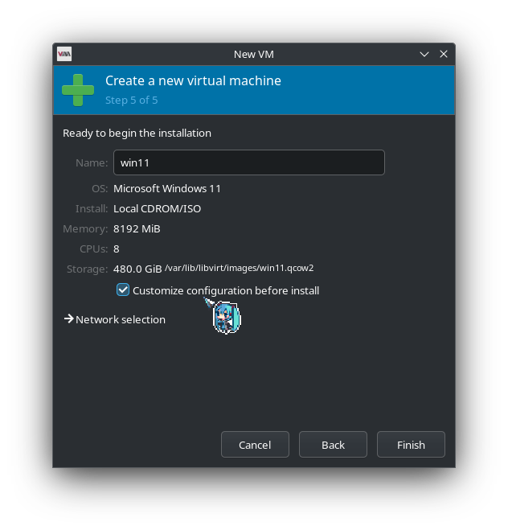

# g14-2022-vfio
This repos contains my steps that I've taken for setting up a GPU passthrough setup on my laptop. The hook scripts I've used is also contained within this repo.

Follow along on this guide as well for any unclear steps: [asus-linux.org guide](https://asus-linux.org/guides/vfio-guide/)


# Device info
ASUS ROG Zephyrus G14(2022) GA402RJ

BIOS Version 319
(If you have a older BIOS you may have a better time)

Fedora Kionite 41


# Preparations

### Install necessary packages:

```bash
rpm-ostree install libvirt qemu-kvm-core virt-manager
```

### Disable SELinux (optional, workaround in later section):

`/etc/libvirt/qemu.conf`, uncomment this line and set to 0:

```
#security_default_confined = 1
```

### Enable XML Editing in virt-manager

`Edit > Preferences > Enable XML Editing`


### Disabling supergfxctl

`systemctl disable supergfxd`

VFIO mode is redundant when hybrid (default behavior) works completely fine. Supergfxctl also interferes with drivers and other tools (like `driverctl`)


### Download Windows and VirtIO ISOs:

[VirtIO Stable](https://fedorapeople.org/groups/virt/virtio-win/direct-downloads/stable-virtio/virtio-win.iso)

[Windows ISO](https://massgrave.dev/windows_11_links)


# Create the Windows VM

Use Virt Manager to create a new VM, make sure on Step 5, choose `Customize configuration before install`.



Here's what needs to be changed:

- Disk 1 should have `Disk bus` set to `VirtIO`.
- A SATA CDROM for VirtIO ISO should be added with `Add Hardware -> Storage -> CDROM Device`.
- Network NIC should have `Device model` set to `virtio`.

### Setting the CPU topology and enable hyperthreading

This will significantly speed up the installation time if you are using more than a single core.


Then, click on the `XML` tab and add: 

`<feature policy="require" name="topoext"/>`

under the CPU tags:


### Windows Install Process

Go through the rest of install as usual, you can set `Time and currency format` to `English (world)` to avoid some bloatware.

When you reach the drive selection screen, click on `Load Driver` and choose the folder `virtio-win/amd64/win11`. You can also install the internet driver at the same time. Though you can install the driver later in device manager (and skip Windows account login). The driver is in the folder `NetKVM/w11/amd64`.

Then you can continue the Windows install as normal.

When you get to Windows Account login, choose Work or School, and choose Domain join to avoid Microsoft Account login (may not work, Microsoft is forcing online accounts, SkipOOBE method already don't work on latest iso)

### Debloat

I used to debloat my Windows installs a lot (Used Windows 10 LTSC before, then used Tiny11 and AtlasOS in VMs). However, I found that the performance gained is pretty neglible, especially since we already have overhead with VM. If the goal is best performance, Dual Booting would be better. Therefore, I just use the [Chris Titus Tech's Windows Utility](https://github.com/ChrisTitusTech/winutil).


# Setup the VM with passthrough

I recommend cloning the original VM (without cloning the drive) so that you still have a easy way to boot the VM without GPU passthrough.

### Add PCI hardware

`Add Hardware -> PCI Host Device`

`0000:03:00:00` and `0000:03:00:00` should be added for GPU passthough.

(optional) `0000:07:00:04` can be added for the two USB A ports on the right side of the laptop.

### Add a temporary mouse

`Add Hardware -> USB Host Device`. Just for now to install display drivers, as the SPICE mouse will be very hard to use once the display driver loads.

### Before booting, we need to run scripts to make sure GPU passthrough works

`check_gpu_available.sh` - Checks if the GPU is currently being used by an application.

```bash
#!/bin/sh

DRI_PATH="pci-0000:03:00.0"

if fuser -s /dev/dri/by-path/$DRI_PATH-card || fuser -s /dev/dri/by-path/$DRI_PATH-render ; then
  echo "gpu in use"
  exit 1
fi

exit 0
```

`fix_rebar.sh` - Fixes Code 43, only needs to be ran once per boot.

```bash
#!/bin/sh

VFIO_DEVICE="0000:03:00.0"
echo -n ${VFIO_DEVICE} > /sys/bus/pci/drivers/amdgpu/unbind
echo 8 > /sys/bus/pci/devices/${VFIO_DEVICE}/resource0_resize
echo 1 > /sys/bus/pci/devices/${VFIO_DEVICE}/resource2_resize
```

Run these two scripts `fix_rebar.sh` once, and use `check_gpu_available.sh` before running the VM. We can add these to libvirt hooks to automate it later.

### Boot VM, run Windows update to get drivers.

You should be able to find the GPU in the device manager afterwards


You can turn off the VM now and we can finish setting it up.

### Remove unnecessary things

- Sound ich9
- Console 1
- Channel Spice (only if you don't use looking-glass)
- USB Redirectors
- Edit the VM's XML and find `memballon model="virtio"`. Replace `virtio` with `none`.

### VM hooks

Follow the instruction here on [Asus-linux guide for libvirt hooks](https://asus-linux.org/guides/vfio-guide/#chapter-2-libvirt-hooks).

Make sure that you use the correct VM names.

Then, add the two scripts in start_hooks folder to `/etc/libvirt/hooks/qemu.d/$vmname/prepare/begin/*`.

### Finishing up

Set `Video QXL` model to `None`. You can now use this VM by connecting an external monitor to the HDMI port and pass through USB mouse and keyboard.

If you want to setup looking-glass: See [Asus-linux looking-glass Guide](https://asus-linux.org/guides/vfio-guide/#option-3-looking-glass-setup)

I also have [section]() on some looking glass setup for Fedora Kinoite specially.

If you want to share keyboard and mouse with linux host: See [Asus-linux evdev Guide](https://asus-linux.org/guides/vfio-guide/#option-2-evdev-input)


### Freezing Issues

When you start/stop the VM, you may experience the entire linux display stack crashing (and sometimes recovering). This could be fixed by adding this kernel parameter:

`pci_port_pm=off`

However, this kernel parameter makes my laptop completely unusable as a portable device, as this parameter causes:

- DGPU to never to go D3Sleep, 20-30W on idle :(. You could keep a VM running in the background so that DGPU goes to sleep in the VM, however, the battery drain is still going too high for a portable device.

- Sleep completely breaks my machine for some reason.

You could try to use the following script to turn off power management for the GPU only (and only run it when you need the VM), but this makes the DGPU never going into D3Sleep on host for the rest of the current boot.

```bash
echo 'on' > /sys/bus/pci/devices/${VFIO_DEVICE}/power/control
echo 'on' > /sys/bus/pci/devices/${VFIO_AUDIO_DEVICE}/power/control
```

Personally, making sure that no process is using the GPU makes the first boot successful on most attempts. The hook script should be enough, but you could also completely isolate the DGPU as well. After the VM boots a single time, I usually resets my machine.